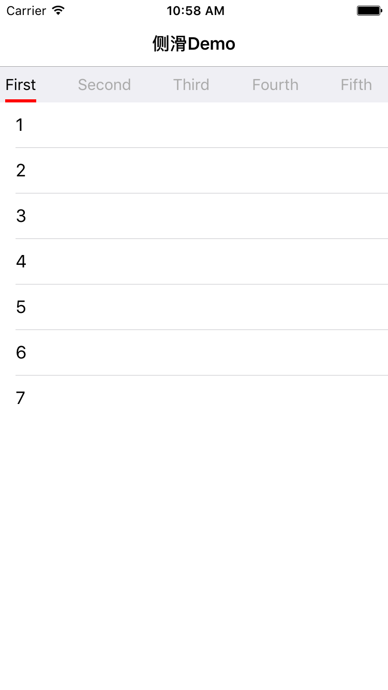
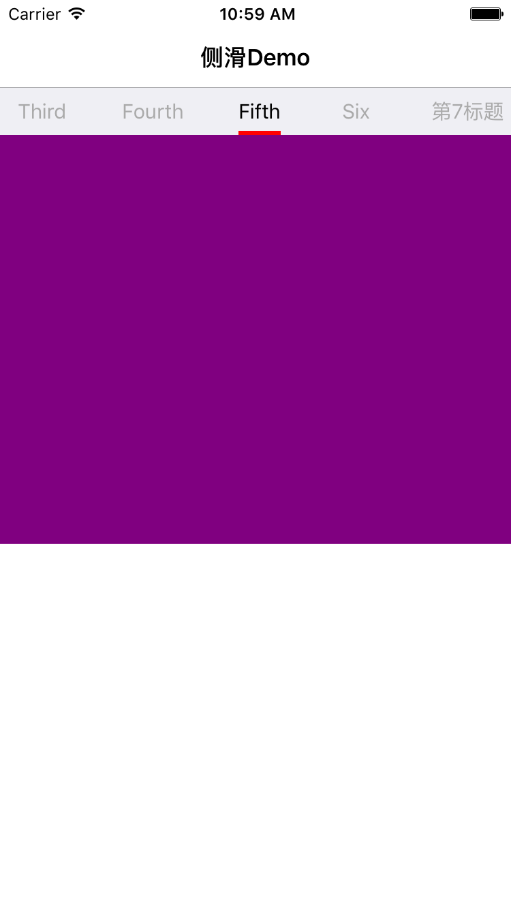

# ContainerDemo
###iOS(OC)侧滑控制很多页面

###图示
  

使用方法：

```
FirstViewController *firstController   = [[FirstViewController alloc] init];
firstController.title                  = @"First";
SecondViewController *secondController = [[SecondViewController alloc] init];
secondController.title                 = @"Second";
ThirdViewController *thirdController   = [[ThirdViewController alloc] init];
thirdController.title                  = @"Third";
FourthViewController *fourthController = [[FourthViewController alloc] init];
fourthController.title                 = @"Fourth";
FifthViewController *fifthController   = [[FifthViewController alloc] init];
fifthController.title                  = @"Fifth";
SixViewController *sixController       = [[SixViewController alloc] init];
sixController.title                    = @"Six";
SevenViewController *sevenController   = [[SevenViewController alloc] init];
sevenController.title                  = @"第7标题";

ContainerViewController *containerController = [[ContainerViewController alloc] init];
containerController.viewControllers          = @[firstController, secondController, thirdController, fourthController, fifthController, sixController, sevenController];
```
